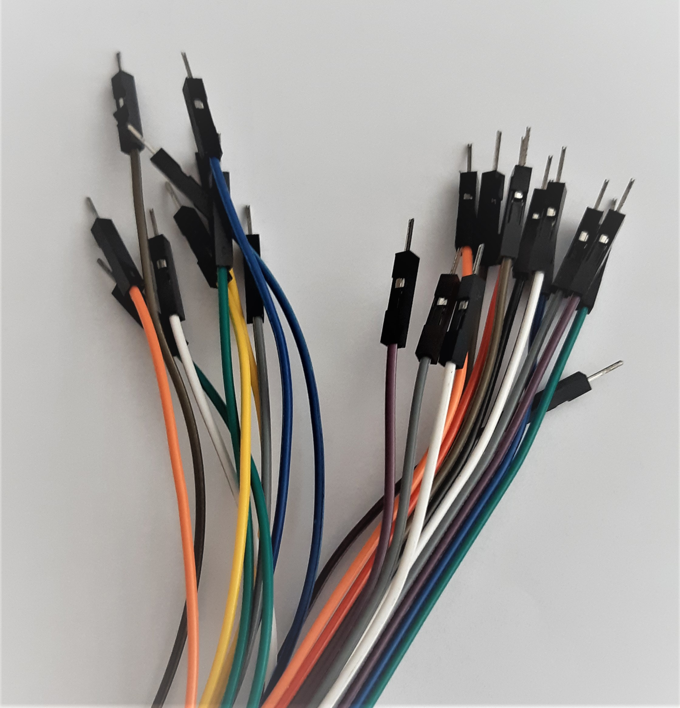
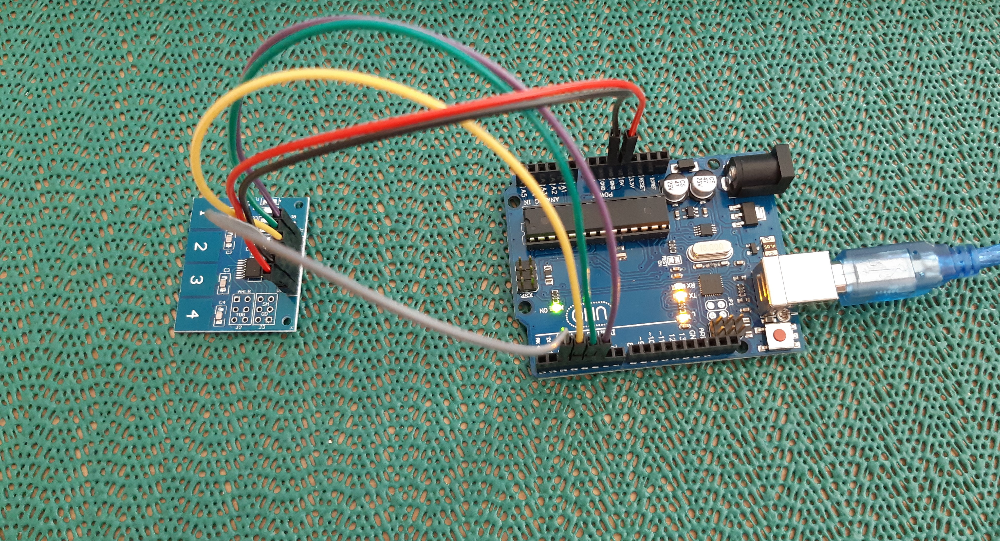
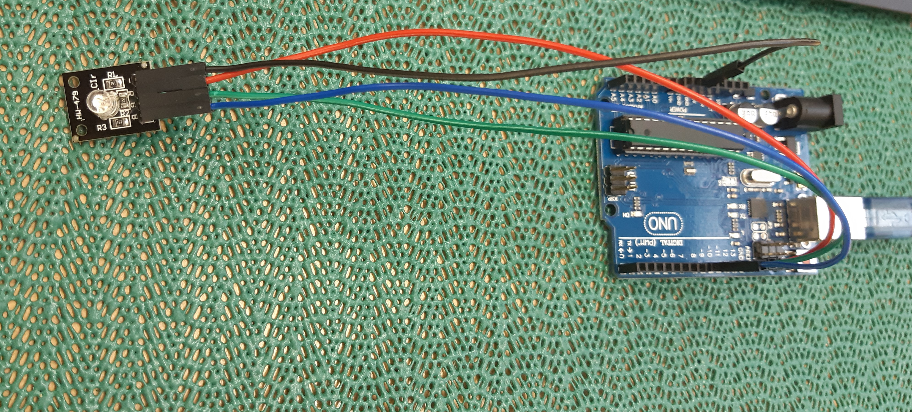

<!--
author:   Abeer Abusobaih

email:    aabusobaih@gmail.com

version:  0.0.1

language: en

narrator:  US English Female

comment:  Try to write a short comment about
          your course, multiline is also okay.

link:     https://cdn.jsdelivr.net/chartist.js/latest/chartist.min.css

script:   https://cdn.jsdelivr.net/chartist.js/latest/chartist.min.js

import:   https://raw.githubusercontent.com/liaTemplates/AVR8js/main/README.md

-->

# Arduino Course

<br/>

<br/>

<br/>

**Title** :  Arduino for Beginners

<br/>

**Grade Level** :  School's students up to 10 years old

<br/>

**Objective of the Course** :

1. To engage and motivate schools student's interest in learning and creating their own electronics with Arduino.
2. To give students more confidence to ask questions and the tools to find the answers and to solve a real-life  problems using hand-on training.

<br/>

**After completing this course students will be able to:**

1. To have the knowledge of the most common hardware components and their usage in electronic circuits.
2. To  write Arduino programs.
3. To create your own projects.

<br/>


**Previous Knowledge**

This course is designed for students who have no or a very little prior experience in electronics and programming.

<br/>

<br/>


## Introduction
<br/>

**Course Description:**

1. Are you interested to build a project using Arduino?
2. Do you want to know and learn everything related to Arduino?
3. Do you want to understand the code load on an Arduino?
4. Do you wish you had a clear path to learn an Arduino?
<br/>

If you answered yes to one or more of the questions above, then you are the person we are trying to help with our course.
<br/>

We know the learning path is not easy, you get stuck sometime, then unstuck and so on ... because of that we designed this course to make you understand in very simple and easy way.

Our course have step-by-step instruction, but still it requires from you to exercise your brain, and we challenge you to make your ideas and think how to apply them according to what you have learnt.  

We designed this course to take you from no knowledge about programming, to being able to understand how to write your own programs for the Arduino projects. To know an exact component to use, and how this component work and connect to microcontroller.

We want to design a path that you can follow, to develop your skills.

## What is an Arduino
<br/>

Have you heard about Arduino ? or have you seen some projects that use an Arduino ?
<br/>

So, **What is an Arduino ?**

<br/>

  

  <br/>


  let's start by understanding the core principles of an Arduino using an example:
  let's say we have a smart house which is equipped with automated lights, this house checks the light intensity of the environment and turns on at night and turns off during the day.


  <br/> <br/> <br/> <br/> <br/> ***So what sort of equipment would be required to build such a system ?!***

You need a light,  light sensor to give us information of the ambient light, and something in between that gets the input from the light sensor and outputs the signal to the light, this something is the brain of the system, and it called a microcontroller unit.

microcontroller like a small computer that can handle small amounts of information fast, and **Arduino** is a company that produces microcontroller boards, they have different versions of microcontroller boards that provide different scenarios but, the most commonly used is the Arduino Uno, the main difference is the size, capacity, and number of pins.

*Arduino* is an open source electronics platform based on easy to use hardware and software, and can be programmed with an Arduin IDE. [1](https://www.arduino.cc/en/guide/introduction)

**Arduino** consists of both a physical programmable circuit board and a piece of software, or IDE.

<br/>

**Why Arduino?**
<br/>

+ The Arduino software is published as open source tools, available for extension by experienced programmers.
+ Arduino designed a microcontroller that is so easy to use from somebody without any prior electronics or programming knowledge.
+ So popular and easy to use.
<br/>

**How does Arduino Work?**
<br/>

Arduino Hardware


Arduino IDE
 

 Arduino Code
  


## Getting Started

This chapter provides an overview of what you need to get started with Arduino.

## Arduino Hardware
<br/>

In this chapter you will find everything related to Arduino hardware, such as sensors, LCD, motors and other components.
<br/>

<br/> <br/> <br/> <br/> <br/>

#### The Arduino UNO
<br/>

The UNO is one of the more popular boards in the Arduino family and a great choice for beginners.
<br/>


 *The major components of the Arduino UNO board are the following*
 <br/>
 <br/>


<br/>

USB Connecter: used to load a program from the Arduino IDE onto the Arduino board, and to give power to the board.
<!-- class = "animated rollIn" style = "animation-delay: 3s; color: green" -->
Power Port: the Arduino board can be powered through a AC to DC adapter.
<!-- class = "animated rollIn" style = "animation-delay: 3s; color: darkred " -->
Microcontroller: It's as the barin of the Arduino, it is like a small computer it has a 28 pins. The Microcontroller used on the UNO board is Atmega328P, and it has the following components in it:
<br/>
+ Flash memory of 32KB, the program loaded from the Arduino IDE is stored here.
<br/>
+ RAM of 2KB. <br/>
+ CPU. It controls everything that goes on within the device.<br/>
+ Electrically Erasable Programmable Read Only Memory (EEPROM), it keeps the data even after device restart and reset.

<!-- class = "animated rollIn" style = "animation-delay: 3s; color: purple" -->
Analog Input pins: There are 6 pins, labeled as "ANALOG A0-A5", used to read the signal from an analog sensor such as the temperature sensor. It converts the analog signal to digital value to make system understand it.
Those pins just measure voltage, only a small amount of current flows through them.

 <!-- class = "animated rollIn" style = "animation-delay: 3s; color: red" -->
Digital pins: They are labeled as "DIGITAL 0-13", can be used either as input or output pins. Pins that labeled with tilde ~ symbol (3,5,6,9,10,11) can act as normal digital pins, but also can be used for Pulse-Width Modulation (PWM), which simulates analog output such as fading an LED in and out.

<!-- class = "animated rollIn" style = "animation-delay: 3s; color: orange" -->
Reset Switch: used to reset the microcontroller. this can be very useful if your code doesn't repeat, and you want to test it multiple times.

<!-- class = "animated rollIn" style = "animation-delay: 3s; color: blue" -->
Crystal Oscillator: On each tick, the microcontroller performs one operation, and it ticks 16 million times in one second.

<!-- class = "animated rollIn" style = "animation-delay: 3s; color: brown" -->
TX RX Indicator: TX stands for transmit, and RX for receive. They blinking whenever the UNO board is transmitting or receiving data.

Atmega328P [Datasheet](http://wiki.amperka.ru/_media/products:arduino-uno:atmega328p-datasheet.pdf)

#### Power Supply
<br/>

There are some ways for powered the Arduino:
1. Battery. <br/>
<br/>
2. AC/DC adapter, which provide an output of 9V and 1A.<br/>
<br/>
3. USB Connecter.<br/>
<br/>
4. 5V pin.<br/>
<br/>


#### Breadboard
<br/>
**What is the breadboard?**

<br/>

It is a rectangular piece of plastic consists of a group of holes, these holes known as connection points are connected in groups of five, there are connections inside those 5 connection points that act like conducting wires. Be carful two adjacent groups are not connected.

Breadboard helps building electronic circuits without soldering any components together, it used to make the necessary connections between individual components.

<br/>

**How you provide power to the breadboard ?**

Most of breadboard types have power rails labeled as + and red color and you can connect a voltage source, and have an easy access to any point. There are a break lines, but you can connect them together using a jumper.

There is also a ground rails labeled as - with blue color and connect it to any ground source.


**How do you connect components on a breadboard ?**

Actually that's so easy, insert the metal leads of your parts inside the connection points. It's important to orient your components the right way.

If you have an integrated circuits or ships place it in the middle of the breadboard, that's what the gap in the middle is designed for.

<br/>

**How to connect components to Arduino**

In Arduino we used a special wires known as jumper wires and they are easy to use and plug directly to most sensors and microcontroller.

Jumper wires have two different types of heads, the one with the pin is known as **male** and the one without pin is known as **female**.

 
<br/>

{1} Breadboard tutorial

!?[Breadboard tutorial](https://www.youtube.com/watch?v=6WReFkfrUIk)

#### Sensors
<br/>

 *Sensor* : an input device which provides an output signal with respect to a specific physical quantity input. It purpose is to detect events or changes in its environment and send information to other electronics.
 A sensor is always used with other electronics.
 Sensors are used in everyday objects such as touch-sensitive elevator buttons. By designed an easy to use microcontroller platforms, the uses of sensors have expanded beyond the traditional fields of temperature, pressure or flow measurement. Moreover, analog sensors such as potentiometers and force-sensing resistors are still used widely. Applications include manufacturing and machinery, airplanes and aerospace, cars, medicine, robotics and many other aspects of our day-to-day life.  


 Generally, Sensors are divided into ten categories according to its basic sensing function as following:

 1. Temperature Sensors

 2. Photoresistor sensors

 3. Gas sensors

 4. Touch sensors

 5. Magnetic sensors

 6. Humidity sensors

 7. Sound sensors

 8. Radiation sensors

 9. Color sensors

 10. Taste sensor

 There is something common in most of sensors is the power pins, most of them have a positive pin which is denoted by the voltage level and a negative pin which is denoted by the ground.

##### Ultrasonic Sensor
<br/>

 Ultrasonic sensor HC-SR04. It can measure distance from 2 centimeters to up to 4 meters with a ranging accuracy up to 3 mm.

 The sensor has 4 pins, VCC, Trig, Echo and Gnd. The ground and the voltage pins of the module have to be connected to the ground and 5V pins on the Arduino board respectively. Trig and Echo pins to any digital input/output pin on the Arduino board.

 To generate the ultrasound, the Trig should be set on a HIGH state for 10 microseconds, this will send 8 cycle sonic waves which will travel at speed of sound and it will be received in the Echo pin. The Echo pin will output the time in microseconds time from sending ultrasonic to returning. Then we can calculate the distance. Distance = (high level time × velocity of sound (340M/S) /2  

 <br/>
{1} The connection


{2} The code  

```javascript
#include <LiquidCrystal.h>


#define trig 13
#define echo 12

int distance =0;
int t=0;
const int rs = 11, en = 10, d4 = 5, d5 = 4, d6 = 3, d7 = 2;
LiquidCrystal lcd(rs, en, d4, d5, d6, d7);
void setup() {
  // put your setup code here, to run once:
Serial.begin (9600);
lcd.begin(16,2);
lcd.clear();
pinMode (trig,OUTPUT);
pinMode (echo,INPUT);
lcd.print("distance");
}

void loop() {
  // put your main code here, to run repeatedly:
digitalWrite (trig,LOW);
delayMicroseconds (5);
digitalWrite (trig,HIGH);
delayMicroseconds (10);
digitalWrite(trig,LOW);
t= pulseIn (echo,HIGH);
distance=t/57;    

lcd.setCursor(0,1);
lcd.print(distance);
delay (1000);

}
```
<br/>

{3} The output

!?[Ultrasonic video](pic/ultrasonic.mp4)

##### Microphone Sensor

<br/>
It also called a sound sensor used to sound level meter, a clapping meter or a noise alarm. The sensor contains in of it a microphone and potentiometer that can be turned clockwise and counterclockwise to adjust the level of the boundary.

The sensor captures the sound waves with its microphone, these sound waves are translated into resistance and it's resistance is exactly the same as the amount of sound, this means that where is a lot of sound then there is also a high resistance, and where is no sound there is almost no resistance. Signal will appear as LOW or HIGH and there is a boundary between them.

The sensor has 4 pins, AO, G, +, and DO. The + pin will connect to 5V on the Arduino board, G on the GND, AO to any analog inputs pin on the Arduino board, and DO to any digital pins.

<br/>

1. **The circuit**


2. **The code**

```javascript
int pin_analog = A0;
int pin_digital = 7;
// variables to store sensor data
int val_A0 = 0;
int val_D = 0;

void setup()
{
  Serial.begin(9600);

  //Define digital pin as input)
  pinMode(pin_digital, INPUT);
}

void loop()
{
  val_A0 = analogRead(pin_analog);
  val_D = digitalRead(pin_digital);
  Serial.print("A0:");
  Serial.print(val_A0);
  Serial.print("  D0:");
  Serial.println(val_D);
  //low intensity
  if (val_A0 > 20 && val_A0 < 300)
  {
   Serial.println("quiet");
  }
  //medium
  if (val_A0 > 301 && val_A0 < 700)
  {
    Serial.println("regular");
  }
  //high
  if (val_A0 > 701)
  {
    Serial.println("noisy!!!");
  }
  delay(50);

}
```
3. **The output**


##### Capacitive Touch Sensor
<br/>

The most amazing future of a capacitive sensor is its ability to sense through a completely shield housing. It works by detecting the change of capacitance due to the influence of external object.
When the capacitance changes, the circuits and the algorithm infer the presence of the external object. So, where is the capacitor, and how does the human finger change the capacitance ?
A common model is that the electrode forms one plate the capacitor, and the grounded finger forms the other plate and changes to overall capacitance of the sensor.

We use it to make designs more user friendly where there is no contact require in general. They use in portable devices whether it's a portable consumer, portable medical devices and some of industrial applications.

The sensor consists of 6 pins VCC, GND, OUT4, OUT3, OUT2, and OUT1. Where VCC needs to connect to 5V on the Arduino board, GND to GND on Arduino board, and outputs pins can connect to any digital pins on Arduino board.

{1} The Circuit




{2}  The code

```javascript
#define AHLB_VDD                    // Conditional Compilation.

const byte the_pins[]={2,3,4,5};
//const byte the_pins[]={9,8,7,6};  // use this combo if easier to wire
            // use any sequence where Module Pad #1
            // is the first array element e.g. {6}
            // should display adequately with this sketch.
int i;
boolean re_start=true;
void setup()
{
  Serial.begin(9600);
  // Set the pin modes on digital pins
  for(i=0; i<sizeof(the_pins); i++)
  {
    #ifdef AHLB_VDD
    pinMode(the_pins[i], INPUT_PULLUP);  //Internal pull up not useful in open drain
                                         //but does no harm.
    #else
    pinMode(the_pins[i], INPUT);
    #endif
  }
  //Serial.println("Enter Loop Processing");  //Only of utility when loop() is empty (or suspect)
  re_start=true;
}

void loop()
{
  if(re_start) {Serial.println("Ready to go");re_start=false;}
  String a_msg="";
  for(i=0; i<sizeof(the_pins); i++)
  {
    #ifdef AHLB_VDD
    if(digitalRead(the_pins[i]) == LOW)
    #else
    if(digitalRead(the_pins[i]) == HIGH)
    #endif
    {
      //Correlate to module Key Pads
      a_msg += String(i+1);
    }
    else {
      a_msg += " ";
    }
    a_msg += " ";
  }
  String b_msg=a_msg;
  a_msg.trim();
  if (a_msg.length()>0)   Serial.println(b_msg);
  delay(250);         // 4 times per second
}
```


{3} The output


<br/>


!?[Capacitive sensor tutorial](https://www.youtube.com/watch?v=QItuf6lNvmI)

##### IR Line Sensor

The IR sensor can detect the difference between a reflective and a non-reflective (white/black) surface and output a TTL signal.  It can be used for line following, collision risk detecting or edge detection projects.

The sensor has 3 pins, VCC, OUT, and GND, where VCC and GND have to be connected to 5V and ground on the Arduino board respectively, and OUT pin to any digital input pins on the Arduino board. It has an infrared LED and a light sensor, which also works in the IR band. The LED illuminates the surface under the sensor in the IR band, and the reflected light is captured by the light sensor.  

{1} The Connection

<br/>


{2} The Code

```javascript
#define Digital 2   //Digital Input for IR Line Sensor Module


void setup() {
  //setup the input and output pins

  pinMode(Digital, INPUT);

  // initialize serial communication at 9600 bits per second:
  Serial.begin(9600);
}

void loop() {

  if(digitalRead(Digital) == 1) // if digital input is high
  {
   Serial.print("Non-Reflective");

  }
  else
  {
    Serial.print("Reflective");

  }
  delay(300);
}

```

{3} The output

<br/>

!?[IR ](pic/ir.mp4)

#### Motors


Motors are very important devices and they are used everywhere from pumping the water to power elevators and cranes even cooling nuclear stations. Motor turns electrical energy into mechanical energy which we can use to drive pumps, fans, compressors, gears and pulleys.  

Almost all the parts are held inside the main housing, in the front there is the shaft, the part that rotates and can connect things like pumps, gears and pulleys to do work.

<br/>

*In general motors divided into 2 types, AC and DC.*

<!-- class = "animated rollIn" style = "animation-delay: 3s; color: red" -->
AC motor energy comes from generating electromagnetics field while connecting to the electrical supply.

<!-- class = "animated rollIn" style = "animation-delay: 3s; color: blue" -->
DC motor energy comes from batteries or other power supply sources and offer constant voltage.


##### Servo Motor

<br/>

Servo motor has a gearing set in a control circuit to make sure that the position stay the same, so it controls the position more precisely than the standard DC. It designed where the position is more important. It uses in things like robot arms or boat rudders.

It has an internal controller board monitors to adjust the required position. The shaft position is controlled using Pulse Width Modulation (PWM). A pulse of 1.5 milliseconds will cause the servo to rest at the 90 degree position, reducing the pules to 1.0 milliseconds will cause the servo motor to go to the zero position. Increasing the pulse to 2.0 milliseconds will cause the servo motor to go to 180 degree position.

<br/>

It has 3 pins, one for the power, one for the ground and one for control.

<!-- class = "animated rollIn" style = "animation-delay: 3s; color: brown" -->
First pin with brown color for ground.

<!-- class = "animated rollIn" style = "animation-delay: 3s; color: red" -->
Second pin with red color for power.

<!-- class = "animated rollIn" style = "animation-delay: 3s; color: orange" -->
Third pin with orange color for control.

<br/>

 **Most servo motors travel a range of 180 degrees to 270 degrees.**

{1} The Code

```javascript
#include <Servo.h>

Servo myservo;  // create servo object to control a servo
                // twelve servo objects can be created on most boards

int pos = 0;    // variable to store the servo position

void setup()
{
  myservo.attach(9);  // attaches the servo on pin 9 to the servo object
}

void loop()
{
  for(pos = 0; pos <= 180; pos += 1) // goes from 0 degrees to 180 degrees
  {                                  // in steps of 1 degree
    myservo.write(pos);              // tell servo to go to position in variable 'pos'
    delay(15);                       // waits 15ms for the servo to reach the position
  }
  for(pos = 180; pos>=0; pos-=1)     // goes from 180 degrees to 0 degrees
  {                                
    myservo.write(pos);              // tell servo to go to position in variable 'pos'
    delay(15);                       // waits 15ms for the servo to reach the position
  }
}
```
<br/>

{2} The Output

!?[IR ](pic/servo.mp4)

##### Stepper Motor

Stepper motor is a motor that moves in discrete steps, after each step the motor holds itself position. It utilizes multiple toothed electromagnets around arranged the central gear, that requires an external control circuit to energize there magnets at the right command, when one magnet turned off the next one is turned on and attract the gear to the new position. It has predefined step angle through a full 360 degree rotation. It routes 4096 steps per revolution.

There are two types of stepper motor:

+ Unipolar.

+ Bipolar.

Bipolar is the strongest, it has four leads with two sets of electromagnetic coils powered individually.

Unipolar less stronger and usually identify by six or eight leads with two coils but each has a center tap to has less torque resistance.

Stepper motor is good, the rotation is precise and they are easy to control. They are suited for 3D printers and similar devices where position is really important.

BYJ-48 it's an unipolar stepper motor runs on five volts, it has 5 pins, and it is a unipolar motor. To connect stepper motor in Arduino board, we use ULN2003 chip instead of using separated transistors.  

<br/>

{1} The Circuit

<br/>

First connect the stepper motor with the ULN 2003 chip, then connect the chip with VCC and ground. The four IN1 to IN4 connect then to any digital input pins on the Arduino board.

The first step is to activate the first file and the 3 files will be off, the next step the second file on and the rest are off and so on.


<br/>

{2} The Code

```javascript
int in1Pin=8;
int in2Pin=9;
int in3Pin=10;
int in4Pin=11;


void setup() {

 pinMode (in1Pin, OUTPUT);
 pinMode (in2Pin, OUTPUT);
 pinMode (in3Pin, OUTPUT);
 pinMode (in4Pin, OUTPUT);

}

void loop() {
  // 4 step mode

digitalWrite(in1Pin, HIGH);
digitalWrite(in2Pin, LOW);
digitalWrite(in3Pin, LOW);
digitalWrite(in4Pin, LOW);
delay(5);

digitalWrite(in1Pin, LOW);
digitalWrite(in2Pin, HIGH);
digitalWrite(in3Pin, LOW);
digitalWrite(in4Pin, LOW);
delay(5);

digitalWrite(in1Pin, LOW);
digitalWrite(in2Pin, LOW);
digitalWrite(in3Pin,HIGH);
digitalWrite(in4Pin, LOW);
delay(5);

digitalWrite(in1Pin, LOW);
digitalWrite(in2Pin, LOW);
digitalWrite(in3Pin, LOW);
digitalWrite(in4Pin, HIGH);
delay(5);
}
```
{3} The Output

!?[IR ](pic/stepper.mp4)

#### LCD Display

<br/>

 LCDs are used in various things and equipment, we started to see them used in calculators and digital watches, and now they have progressed into all sorts of displays including video display and most televisions. LCDs have an advantage that they are easy to manufacture and mass-produce so they can be made quite inexpensively and they are very versatile devices. They are low current so they don't need a lot of power.

 LCDs work in a principle of a liquid crystal which can align itself between two polarized filters and then either they let the light pass or they block the light. LCDs they are either two or four line displays.

The LCD showed below called 1602 display, it consists of 16 characters across on the row, and it has two rows. I2c adapter it allows you to use the i2c bus to communicate with the display.

<!-- class = "animated rollIn" style = "animation-delay: 3s; color: green" -->
It has 16 pins, the connection of there pins like below:
<!-- class = "animated rollIn" style = "animation-delay: 3s; color: black" -->
VSS to the ground.
<!-- class = "animated rollIn" style = "animation-delay: 3s; color: red" -->
VDD to the power pin.
<!-- class = "animated rollIn" style = "animation-delay: 3s; color: brown" -->
VO is for the brightness of the display.
<!-- class = "animated rollIn" style = "animation-delay: 3s; color: green" -->
RS is the register select pin.
<!-- class = "animated rollIn" style = "animation-delay: 3s; color: orange" -->
RW is the read/ write pin.
<!-- class = "animated rollIn" style = "animation-delay: 3s; color: purple" -->
E is the enable pin.
<!-- class = "animated rollIn" style = "animation-delay: 3s; color: green" -->
DO to D7 are the parallel data input pins.
<!-- class = "animated rollIn" style = "animation-delay: 3s; color: red" -->
A is the anode of the backlight LED, and connect it to power supply.
<!-- class = "animated rollIn" style = "animation-delay: 3s; color: black" -->
K is the cathode of the backlight LED.

<br/>

LCD works on parallel data and takes in one byte at a time and this requires 8 connections which is a lot of connections to make to a microcontroller, but we can run the display in a half byte mode and in this case data pins D4 through D7 are transit one half of a byte at a time, this cuts down on the number of wires that you will use.

Arduino IDE comes with a library called liquid crystal and it had some examples.

{1} The Circuit


{2} The Code

```javascript
// include the library code:
#include <LiquidCrystal.h>

// initialize the library by associating any needed LCD interface pin
// with the arduino pin number it is connected to
const int rs = 12, en = 11, d4 = 5, d5 = 4, d6 = 3, d7 = 2;
LiquidCrystal lcd(rs, en, d4, d5, d6, d7);

void setup() {
  // set up the LCD's number of columns and rows:
  lcd.begin(16, 2);
  // Print a message to the LCD.
  lcd.print("hello, Welcome");
}

void loop() {
  // set the cursor to column 0, line 1
  // (note: line 1 is the second row, since counting begins with 0):
  lcd.setCursor(0, 1);
  // print the number of seconds since reset:
  lcd.print("to our course!");
}

```

#### Real Time Clock

<br/>

Real time clock it's called a Tiny RTC module, it counts time, date, day of week, month and year. It can use 12 or 24 format, it has a leap year compensation to year 2100. It use a i2c 2-wire serial interface. In addition to its clock function it also has a programmable square wave output. It has a battery backup with automatic power failure detects and switchover.

It has pins repeated in both sides. The first pin is DS --> Device select to enable or disable the device.
Next is the i2c serial clock followed by two i2c serial data, VCC connection is for the power supply, square wave (SQ) output, and an output from the backup battery.

<br/>

So connect pins like below:

SCL --> A5

SDA --> A4

VCC --> 5V

GND --> GND.

#### RGB LED Module

<br/>

RGB LED uses to state or to make your project stand out.

It has 4 pins (ground, blue, green and red), you can connect - to the ground on the Arduino board, R, G and B pins to any digital input pins on the Arduino boards.

{1} The Connection

 

{2} The Code

```javascript
const int redPin = 11;
const int greenPin = 10;
const int bluePin = 9;

void setup() {
  // Start off with the LED off.
  setColourRgb(0,0,0);
}

void loop() {
  unsigned int rgbColour[3];

  // Start off with red.
  rgbColour[0] = 255;
  rgbColour[1] = 0;
  rgbColour[2] = 0;  

  // Choose the colours to increment and decrement.
  for (int decColour = 0; decColour < 3; decColour += 1) {
    int incColour = decColour == 2 ? 0 : decColour + 1;

    // cross-fade the two colours.
    for(int i = 0; i < 255; i += 1) {
      rgbColour[decColour] -= 1;
      rgbColour[incColour] += 1;

      setColourRgb(rgbColour[0], rgbColour[1], rgbColour[2]);
      delay(5);
    }
  }
}

void setColourRgb(unsigned int red, unsigned int green, unsigned int blue) {
  analogWrite(redPin, red);
  analogWrite(greenPin, green);
  analogWrite(bluePin, blue);
 }
```
{3} The Output

!?[RGB LED ](pic/RGB.mp4)

## Programming the Arduino

<br/>

To do any project with Arduino, you need hardware, an interface to write the code and the instructions (code) that you want to the project to do.

For more details about the Arduino software you can visit this link. ([Arduino Software](https://www.arduino.cc/en/software)).


#### The IDE Interface

<br/>

Integrated Development Environment (IDE), is the software that uses to code the Arduino. It's a text editor that allows to write computer code to get uploaded to the Arduino board. The file saved on Arduino called a sketch with file extension .ino. It jobs to translate the written code into machine readable code that can be executed by the Arduino, this process is called **Compiling**.

The first step to have the IDE is to download it from here --> ([IDE download](https://www.microsoft.com/de-de/p/arduino-ide/9nblggh4rsd8?ocid=badge&rtc=1&activetab=pivot:overviewtab)) and install onto your computer for free.

After you get download it, when you open it up it will open a blank page called sketch like below:

 

If you want to change the language or the font size and other things, you can do it from file --> preferences

 

 Under the Arduino toolbar options are File, Edit, Sketch, Tools and help. Go over file, it has the most common orders like open, new, save, and examples. the valuable thing in the file is examples, from it you can go through many examples codes and use them in your project.

 Over the Edit menu there are many options like copy for forum or copy as HTML where  you can copy the code on the page in a format that you can either put into a forum or put into HTML, this is important because when you copy the page, it copies it in a fashion that when you paste it as forum or HTML page will not read it as a code itself but as a standard text.

 In the Sketch menu, from this menu you can verify and compile the code, before upload the code to the Arduino is going to verify during the upload process, so if there is any kind of issue, it will tell you. If you have a good code basically it shows compiling done and everything is going ok. If there is an issue with the code *missing a semicolon in the last sentences*, a red message will appear in the button of IDE window like below:


You can click verify again to know where and what you missed. If you do not know what the problem, you can search for the solution through the internet.  


Tools menu has many options such as: auto format it clean up the code and make it looks how it's supposed to. Archive format is to save the code into a zip format.

Serial monitor and Serial plotter, serial monitor uses to show the code results as text or number, serial plotter uses to show results as visual representation.

The most important thing in Tools menu is to choose the board and port, if you use Arduino UNO then you should choose it, or which board you use. The next important one is port, show how connect the Arduino to the computer.

<!-- class = "animated rollIn" style = "animation-delay: 3s; color: red" -->
Always save all your sketch files before verify and upload them.


#### Libraries

<br/>

**Arduino library** is a group of functions that are packaged together. Different functions but they do the same thing and Arduino makes sharing these function easy with one another. It is a class that contains both data and functions.

The Arduino IDE comes with pre-installed libraries. By going through Sketch menu from IDE toolbar, then import library, there are some of libraries included. They used If some sensors or hardware components will use in the project.

By clicking any one of those libraries, one line code will be added saying that you want to look through its library before execute the rest of the code.

In contributed from Sketch menu shows which libraries that are not prepackaged in Arduino IDE and there are a lot of libraries, so you have to start looking for libraries that might help with your project. If you want to download any no prepackaged libraries, it comes in zip file, so after download this zip file, then go to sketch ==> include library ==> add.ZIP library, then you can use this library in your code by click on sketch again ==> include library and you will find it in **contributed section**, add it and start writing your code.       


**For adding new libraries ==> use this link** ([Add Libraries](https://www.arduino.cc/reference/en/libraries/))


To see what there is inside the library, navigate to where the Arduino is installed, then to libraries folder, it will find a couple of files. File ends in .h and file ends in .cpp file are the required files in any Arduino library. File with .h contains a list of all the names of the function, and .cpp is the source code that is the actual line-by=line programming of the functions.

<!-- class = "animated rollIn" style = "animation-delay: 3s; color: red" -->
**VIP -->  .h file and .cpp file must both of them match the library name.**

<br/>
{{.h and .cpp files}}


<br/>

Watch this video to know more about Arduino libraries.

!?[Arduino libraries ](https://www.youtube.com/watch?v=fsMg6F6yYlo)

<br/>

<!-- class = "animated rollIn" style = "animation-delay: 3s; color: green" -->
How to create your own Arduino library ?


## Arduino Code

<br/>

The code language that Arduino uses is Arduino C and it's very similar to C++ and C, which is a common language in the world of computing. The code is a human readable that means it is easy for human to follow. Code has both data and functions.

The code consists of two parts: setup and loop. Where `void setup ()` is to setup the environment that the code is going to run in. In this section you can initialize a pin as input or output on your Arduino, and start serial communication. When the program executes it only runs once.

<!-- class = "animated rollIn" style = "animation-delay: 3s; color: brown" -->
*Serial.begin(9600) : This allows to get reading from the Arduino board directly to the computer, so you can know what board is currently experiencing.*

```javascript
// the setup function runs once when you press reset or power the board
void setup() {
  // initialize digital pin LED_BUILTIN as an output.
  pinMode(LED_BUILTIN, OUTPUT);
  }

```
<br/>
 `The void loop ()` part is the actual code that is going to be run. When dealing with Arduino it continuously a loop, it supposed be for sensors for example: Ultrasonic sensor, the loop will read what the current distance is depending on what distance is, and it will set off a series of actions and then loop.

```javascript
// the loop function runs over and over again forever
void loop() {
  digitalWrite(LED_BUILTIN, HIGH);   // turn the LED on (HIGH is the voltage level)
  delay(1000);                       // wait for a second
  digitalWrite(LED_BUILTIN, LOW);    // turn the LED off by making the voltage LOW
  delay(1000);                       // wait for a second
}

```

First thing is to understand the data types, data type tells the compiler how to use a particular piece of data for example is it a number and if it is a number what kind of number is it or if it is a character.

`Data Type`

 **integer (int)** : it indicates that the data can be negative or positive and zero. It takes two bytes in the memory and can be a number between -32,767 to  32,767.

 **float** : it can use for a decimal number like 2.162 or in scientific notation like 6.022E23, where the number after e is the exponent (6.002 * 10 ^23). It take 4 bytes in the memory.

 **byte** : can store a number from 0-255 and it takes one byte of a storage.

**boolean** : It takes one bit of data, it can hold one of two values either true or false. False state can be represented also by 0 or a word LOW. True state can be represented by non=zero number or a word HIGH.

**char** : character data type it takes one byte of storage and it hold a character symbol like a letter, letters are stored as a number and that number represent a specific text character in a system called ASCII, ASCII stands for the American Standard Code for information Interchange, and it's the way that text is encoded numerically in programming.  

**array** : collection of variables that are accessed with an index number. You can initialize and size the array such as for example -->  int myarrayVals[6] = {2, 4, -8, 3, 2};

**string** : uses with sequence of characters, for example --> String stringOne = "Hello String";  .

**Variable** : is a type of container used to store data, each variable should have a name known as identifier and a data type. To write a variable you need to follow this formula -->

**dataType    variableName = value;**

`For example: int t = 8; OR char a ='s';`

` const: indicate that the date is read-only`

<br/>


`loops`

Loops are used when you want some piece of code to execute over and over.

**while loop**

```javascript
while (condition) {

  do this
}
```


The while loop will check the condition first, if it is true the code is executed sequentially, once done,  execution returns to the top of the loop and checks the condition again, and if the code inside the loop still true it will execute again, and returns to the top of the loop, and if it's the code inside the loop false the program will skip the loop and being executing what it comes after the loop.

**For loop**

```javascript
for (initialization; condition; increment) {
  statement(s);
}
```
Initialization happens first and just once, then each time the condition is tested if it's true, the statement will execute, then the increment executes, and the condition is tested again until it becomes false then the loop ends.

**do...while loop**

```javascript
do {
  statement block
} while (condition);

```
The do…​while loop works in the same manner as the while loop, with the exception that the condition is tested at the end of the loop, so the do loop will always run at least once. The condition is Boolean expression that evaluates true or false.

<br/>

`**IF condition**`

```javascript
if (condition) {
  statement(s)
}
```
The if statement checks for a condition and executes the following statement or set of statements if the condition is 'true'. The condition is Boolean expression that evaluates true or false.

<br/>

`Pin Mode`

To configure the pin to behave as input or output.

The syntax --> pinMode(pin, mode);

`Digital Read`

Reads the value from a specified digital pin, either HIGH or LOW. It returns high or low.
 Syntax --> digitalRead(pin);

`Digital Write`

To write a high or low value to a pin. Syntax --> digitalWrite(pin, value); where pin means pin number on the Arduino board and value means high or low.

`Analog Read`

To read the value from the analog pin. The syntax --> analogRead(pin); where pin the analog pin number on the Arduino board.

`Analog Write`

Writes an analog value (PWM wave) to a pin. Can be used to light a LED at varying brightness or drive a motor at various speeds.  Syntax --> analogWrite(pin, value);


`delay`

Pauses the program for the amount of time (in milliseconds) specified as parameter. Syntax --> delay(ms);

`Comments`

use to explain more about the author or a brief and explanation about the code
// for single line comment, /* for multi-line comment  
*/.

<br/>

<!-- class = "animated rollIn" style = "animation-delay: 3s; color: red" -->
`Every statement of the code must have at the end a semicolon ;`


## Tool Guide

<br/>

To know more about components, functions and libraries, you can visit this website --> [More information](https://www.arduino.cc/reference/en/#functions).

<br/>

To read and know more about built-in examples in Arduino IDE you can visit this link --> [Built-in examples](https://www.arduino.cc/en/Tutorial/BuiltInExamples).

## Learning by Example

<br/>

Before you working on any project, you should plan and design it. You should not start implementing the system in practice, while there is still no detailed development plan. The plan should be done in such minute details, that every person can understand how particular sections runs.


{1} First example

                                  **Connect a Microswitch**

Microswitch uses as end sensors or for homing.


You need a microswitch, Arduino UNO, 3 jumpers male to male and a breadboard.

Connect a microswitch directly to the breadboard. Connect the first pin to the GND, the second pin to 5V and the third pin to pin 2 on the Arduino board.

<br/>

* The Connection


In the circuit when you press the microswitch the LED for pin 13 turn on, and when didn't press the microswitch the LED turn off, you can use this connect to teat the Arduino board.

* The Code

```javascript
// constants won't change. They're used here to set pin numbers:
const int buttonPin = 2;     // the number of the pushbutton pin
const int ledPin =  13;      // the number of the LED pin

// variables will change:
int buttonState = 0;         // variable for reading the pushbutton status

void setup() {
  // initialize the LED pin as an output:
  pinMode(ledPin, OUTPUT);
  // initialize the pushbutton pin as an input:
  pinMode(buttonPin, INPUT);
}

void loop() {
  // read the state of the pushbutton value:
  buttonState = digitalRead(buttonPin);

  // check if the pushbutton is pressed. If it is, the buttonState is HIGH:
  if (buttonState == HIGH) {
    // turn LED on:
    digitalWrite(ledPin, HIGH);
  } else {
    // turn LED off:
    digitalWrite(ledPin, LOW);
  }
}

```

* The Output

!?[video](pic/micro.mp4)

## Quiz


1. What does IDE stand for ?

    [[ ]] In Deep Environment.
    [[X]] Integrated Development Environment.
    [[ ]] International Deep Environment.


2. It starts with a /* and continues until a */  What does this do?

    [[X]] Make a comment.
    [[ ]] Write a text.
    [[ ]] Print a star.

3. The function needs to start reading from Arduino to computer ?

    [[ ]] Serial.begin().
    [[X]] Serial.begin (9600).
    [[ ]] serial.begin (9600).

4. Which command is called once when the program starts ?

   [[ ]] void loop().
   [[X]] void setup().
   [[ ]] void().

5. How many analog pins Arduino UNO has ?

   [[ ]] 5.
   [[X]] 6.
   [[ ]] 7.

6. Write  a code that makes the LED blinks.

[[  See the code below ]]

``` json    -the solution
void setup() {
  // initialize digital pin LED_BUILTIN as an output.
  pinMode(LED_BUILTIN, OUTPUT);
}

// the loop function runs over and over again forever
void loop() {
  digitalWrite(LED_BUILTIN, HIGH);   // turn the LED on (HIGH is the voltage level)
  delay(1000);                       // wait for a second
  digitalWrite(LED_BUILTIN, LOW);    // turn the LED off by making the voltage LOW
  delay(1000);                       // wait for a second
}
```
